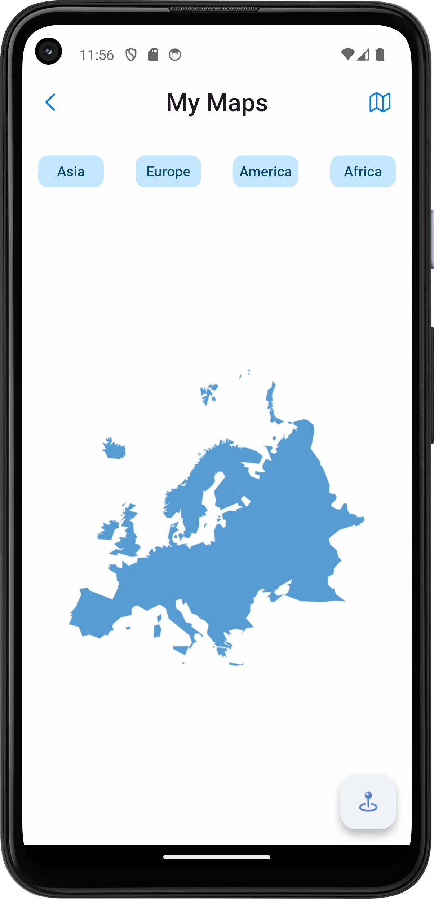

# My Maps  

**My Maps** is a UI-focused Flutter app designed to showcase a visually appealing map interface. The app leverages `MediaQuery` to ensure responsiveness and adaptiveness across various screen sizes and devices.  

## Features  
- Interactive and intuitive map-based user interface  
- Fully responsive design with `MediaQuery`  
- Optimized for both small and large screens  

## Screenshot  
Here’s a preview of the app:  

  

## Tools & Technologies  
- **Flutter**: For building the app UI  
- **MediaQuery**: To achieve a responsive layout  
